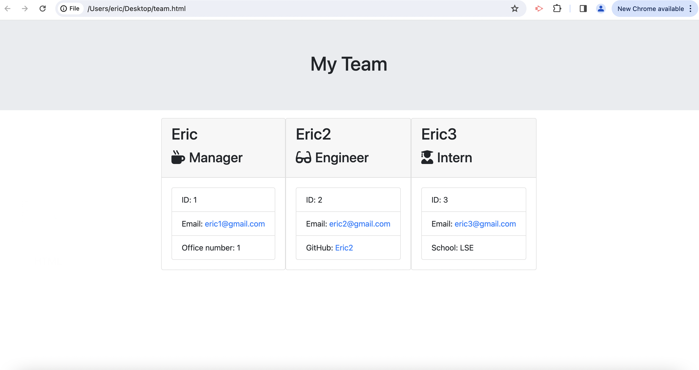

# Eric's Team Profile Generator
  

  ## Description
  This is a node.js application that allows the user to generate a HTML team profile file from the console built with the Inquirer package, test driven development and multiple classes / subclasses.

  ## Table of Contents
  - [Installation](#installation)
  - [Usage](#usage)
  - [License](#license)
  - [Contributing](#contributing)
  - [Tests](#tests)
  - [Questions](#questions)

  ## Installation
  Node.js and the Inquirer (v.6.5.2, the latest version of Inquirer will not work) package from NPM are required to use this application.

  The Jest package from NPM is required to test this application.

  Follow the instructions at [Node.js](https://nodejs.org/en) to download and install Node.js.

  Once Node.js is installed, you can install the Inquirer and Jest packages by first initialising NPM in the local folder, you can do this via the "npm init -y" command on console, and then installing Inquirer v.6.5.2 by using the "npm i inquirer@6.5.2" command.

  Run "npm i jest" to install the Jest package.

  ## Usage
  Please open the console, and use the command "node index.js" and follow the prompts.

  Your generated team profile HTML file will be in the output folder. Please use a browser to view your generated team profile. Please note - running a new instance of team profile generator will override the old team profile file in the output folder. To avoid deleting previous team profiles, move those generated files out of the output folder before generating a new team profile.

  The generated team profile should look like this:
  

  ## License
  This application is released under the GNU General Public License v3.0 license. Please refer to the license file for more information.

  ## Contributing
  Feel free to take this code and build something else. This is a relatively simple project so I will not be updating it!

  ## Tests
  To run a rest, simply run "npm run test" via the console for Jest testing.

  Otherwise, feel free to create a simple team profile with one manager, one engineer and one intern by following the prompts.

  ## Questions
  For any questions, please contact the developer via either of the following:
  - [Github](https://github.com/KidLeiS)
  - Email: [eric.shen123@gmail.com](eric.shen123@gmail.com)
  